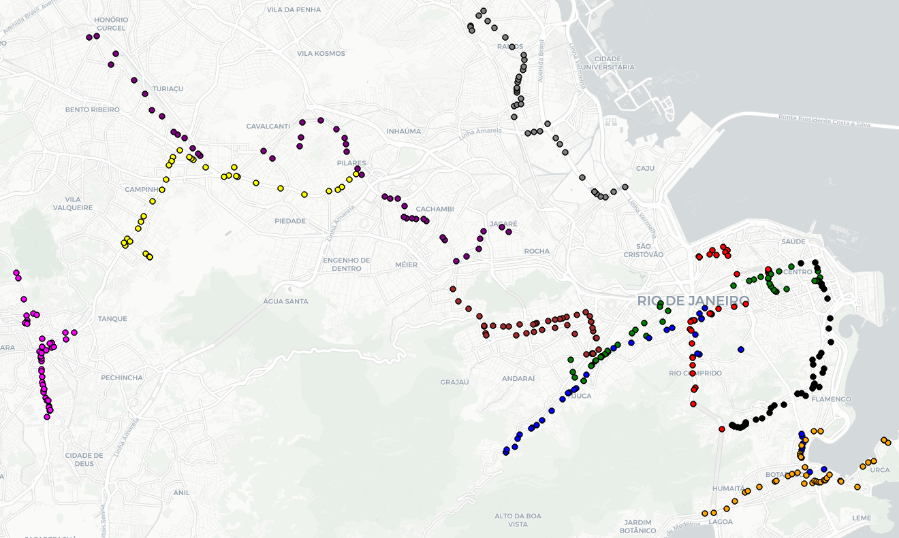
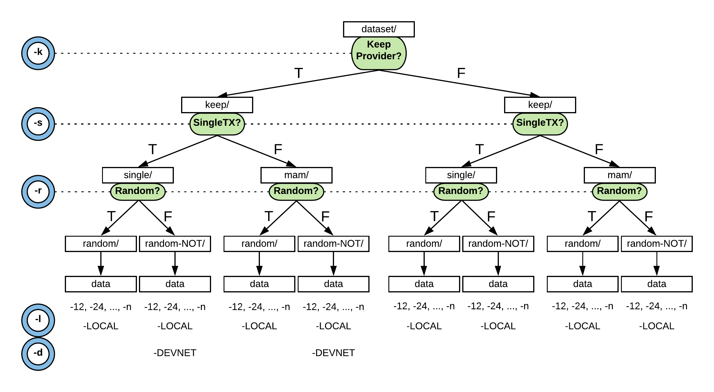

# Testing IOTA

Testing aimed to evaluate the performances of IOTA DLT in a vehicular scenario. The script takes in input `inputDataset.csv` in order to simulate buses sending data (latitude ,longitude) to a IOTA MAM channel.
`inputDataset.csv` contains real traces of buses in Rio ([source](https://crawdad.org/coppe-ufrj/RioBuses/20180319/))


## Usage

(Requires nodejs v10, because of the local PoW library)

install [Ccurl](https://github.com/iotaledger/ccurl)

```
$ git clone --recursive https://github.com/iotaledger/ccurl.git
$ cd ccurl && mkdir build && cd build && cmake .. && cd .. && make -C build
```

Then, in another directory

```
$ git clone https://github.com/miker83z/testingIOTA
$ cd testingIOTA
$ npm install
$ node script.js
```

- Case 1 :
- Case 2 :

### Command Line Arguments

Command line arguments are used to define a path to take during the testing execution

- `-k` or `-keepinitial`: each bus keeps the same IOTA provider for the whole duration of the test
- `-s` or `-single`: only a single transaction is published instead of a MAM message (which requires 3 transactions)
- `-r` or `-random`: IOTA providers are picked random between the list of public ones
- `-l` or `-localpow`: the POW is performed locally
- `-d` or `-devnet`: the only provider used is https://nodes.devnet.thetangle.org that operates on the devnet
- `-i` or `-iter`: number of iteration of the test (default 1)
- `-w` or `-window`: window size when picking the best providers (default 10)
- `-c` or `-ccurl`: relative path for ccurl library (default '../ccurl/build/lib')

### Dataset

The dataset is organized following this tree logic

